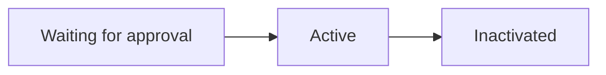
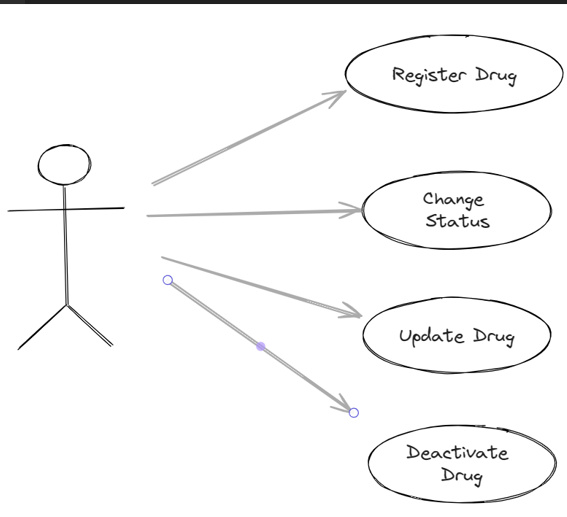
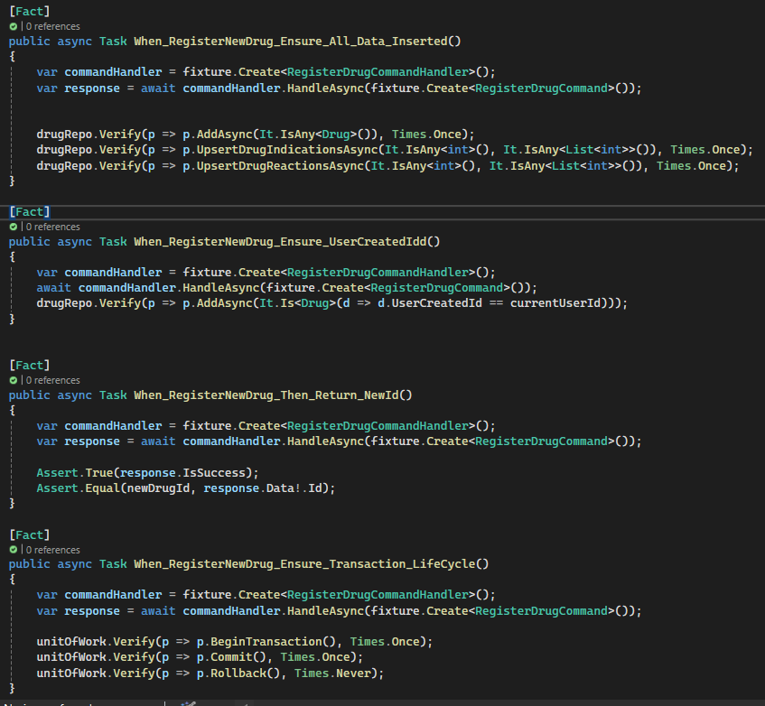
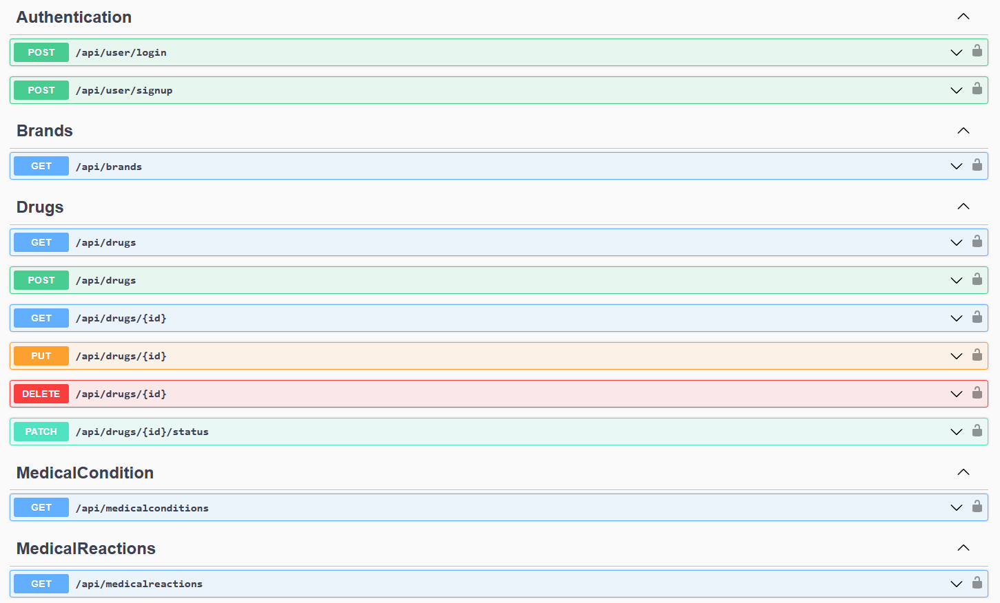
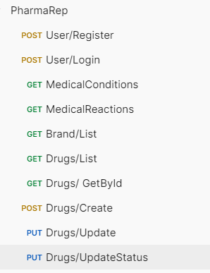
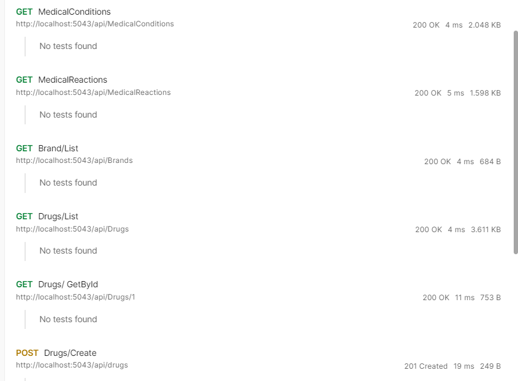

# Pharma-Application Documentation
C# and .NET 8 - Project Sample

## Introduction

Pharma-Application is a project designed with minimal external dependencies. This project aims to provide a robust and efficient solution for pharmaceutical needs.

- No Mediator
- No Fluent Validation
- No Entity Framework
- No Dapper

#### Concepts
- Clean Architecture
- CQRS (From Scratch) 
- UnitOfWork (From Scratch) 
- JWT Authentication
- Unit Tests
    
## Getting Started

## Initial Requirements
The system should allow users to retrieve detailed information about drugs, including associated medical conditions, potential reactions, and brands.

The system should implement the CQRS pattern, segregating commands (state-modifying requests) and queries (state-reading requests).


### Drug Status Life Cycle

### Drug User Cases


### Usage
To use the `Pharma-Application`, you need to have Docker and Docker Compose installed on your machine. 
Once you have those installed, follow these steps:

1. Navigate to the root directory in your terminal.

2. Run the following command to start the application:

```bash
docker-compose up
```


#### Containers
`webapp`: This container runs the main application, which is built using .NET 8. This application serves as the front-end interface for users to interact with. It communicates with the db container to perform database operations.

`db`: This container runs SQL Server, which is used to store and manage the application's data. It receives requests from the webapp container and performs the necessary database operations.
>entrypoint.sh will generate the initial data on Database

#### Tables:
- Drug: This table stores information about various drugs, including their names, description, and other relevant details.

- DrugReaction: This table associates drugs with potential medical reactions. It serves as a many-to-many relationship table between the Drug and MedicalReaction tables.

- DrugIndication: This table associates drugs with the medical conditions they are used to treat. It serves as a many-to-many relationship table between the Drug and MedicalCondition tables.

- PharmaUser: This table stores information about the users of the Pharma-Application;

- MedicalCondition: This table stores information about various medical conditions that can be treated with drugs.

- MedicalReaction: This table stores information about potential medical reactions that can occur when a drug is taken.

- Brand: This table stores information about the different brands of drugs available in the market.

### Application Layers
#### WebAPI
This layer is responsible for handling HTTP requests and responses. It includes routing, serialization, error handling, and other web-related tasks. It communicates with the Application layer to process requests.
#### Application and CQRS
 It processes requests from the WebAPI layer, performs necessary computations or transformations, and communicates with the Domain layer for data.

> CQRS - command query responsibility segregation

- The Command stack is responsible for handling all commands, which are requests that modify the state of the system. 

- The Query stack is responsible for handling all queries. It is ideal if we need to use a read-replica or a `consolidated` database like `MongoDB` or `Redis`

#### Take a look on GetDrugById
1. We can move data preiodically or by events from relational database to a document database.  
2. Then we can replace the Repository on QueryHandler pointing to the new database

```json
{
    "id": 5,
    "brand": {
        "id": 2,
        "name": "EuroPharma"
    },
    "name": "Omeprazole",
    "description": "Omeprazole is a medicine that reduces the amount of acid produced in your stomach",
    "userCreated": {
        "id": 1,
        "name": "Admin"
    },
    "dateCreated": "2024-01-04T00:09:49.18",
    "drugStatus": 1,
    "adverseReactions": [
        {
            "id": 6,
            "name": "Headache"
        },
        {
            "id": 8,
            "name": "Nausea"
        }
        ...
    ],
    "indications": [
        {
            "id": 6,
            "name": "Allergies"
        },
        {
            "id": 8,
            "name": "Asthma"
        }
        ...
    ]
}
```


 
This separation allows for flexibility in scaling, as the Command stack and Query stack can be scaled independently based on their load. It also improves performance, as read and write operations can be optimized separately.


#### Domain
The Domain layer represents the business objects of the application. It includes entities, value objects, and aggregates. This layer is isolated and should not depend on any other layers.

#### Infra
The Infra layer provides concrete implementations of the interfaces defined in the Domain layer including persistence. 

Also, the dependency injection is there.

## Technical Details

### Unit Tests
I created the most important tests that validates the drug creation and update.



### Swagger / OpenAPI


## Testing using Postman
You can use the [Postman Collection](src/postman-collection/PharmaRep.postman_collection.json)



#### Postman Tests Results
We can execute APIs and enhance the validations on `Postman.tests`

[Last Execution Result](src/postman-collection/PharmaRep.postman_test_run.json)


